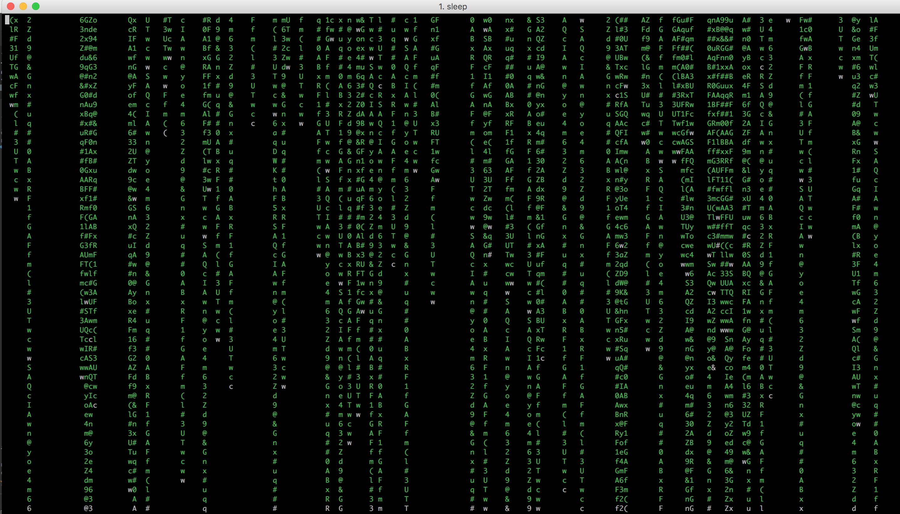

# Matrix Terminal

Just for shits and giggles! Have your very own matrix terminal window.

1) Download the martix.run file
2) chmod a+x matrix.run
3) mv matrix.run ~/matrix.run
4) alias matrix='~/matrix.un'

That's it type matrix in your terminal and hit enter.

